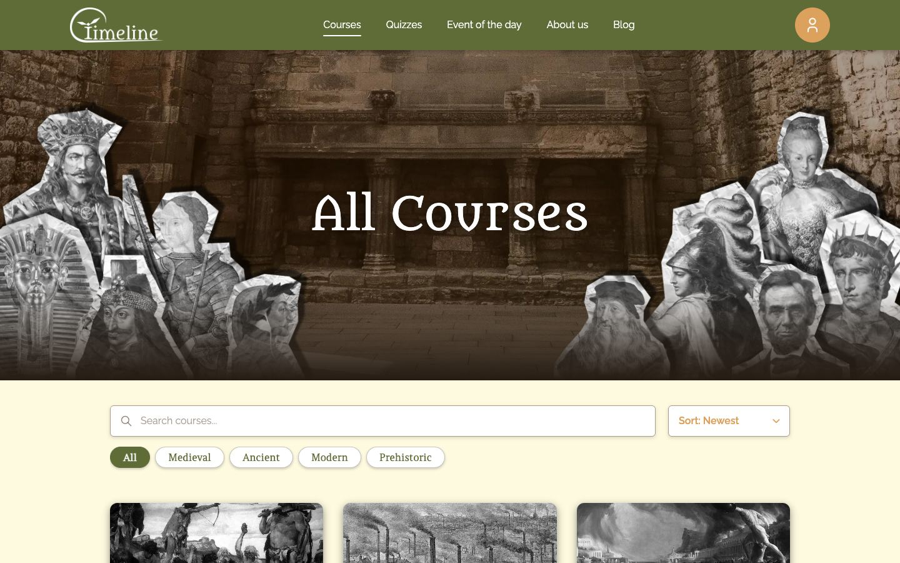
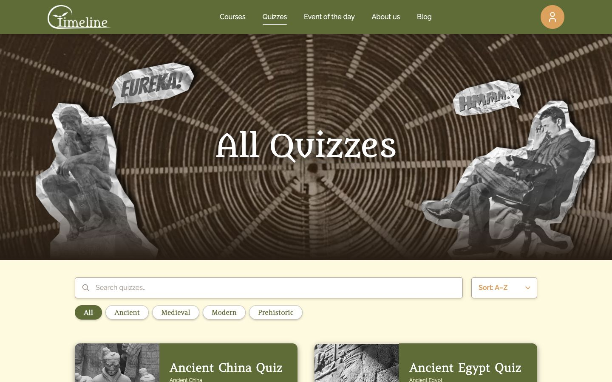
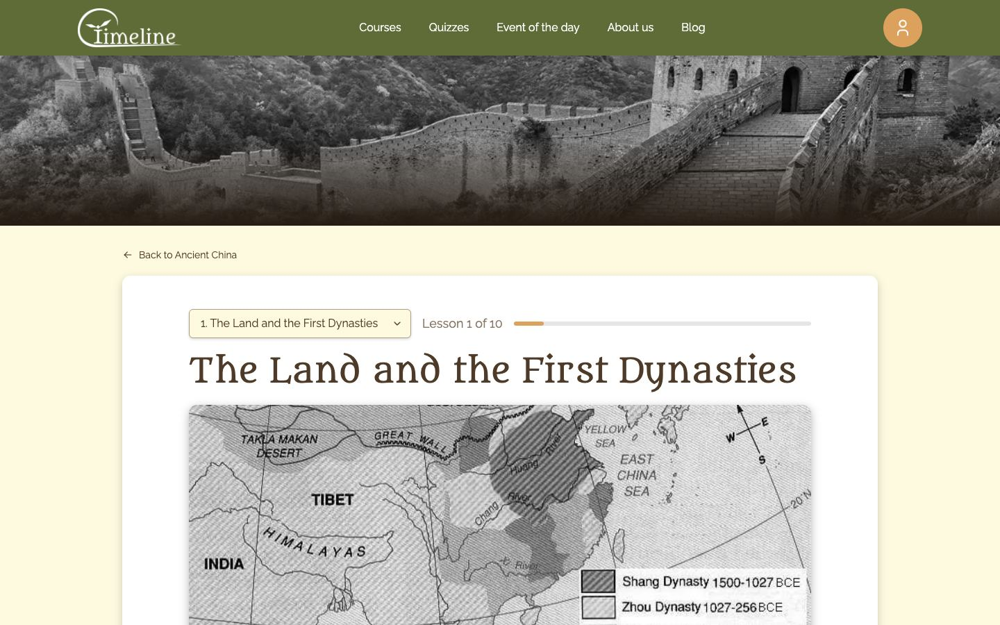
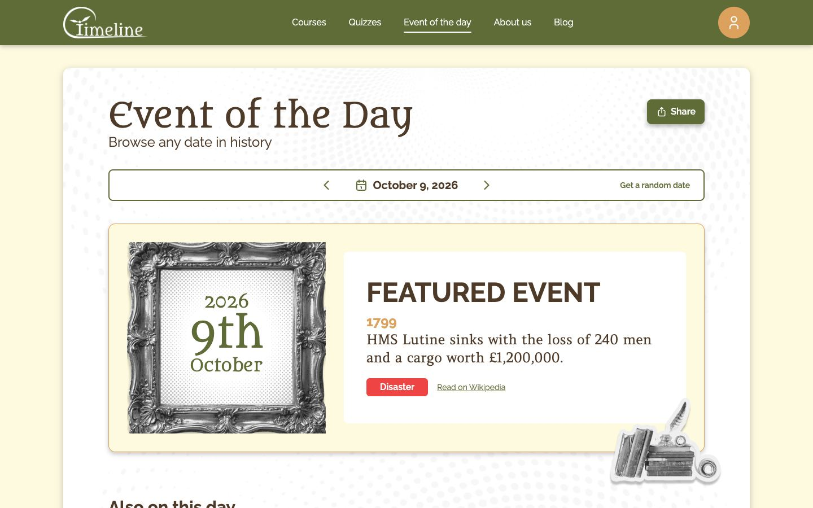
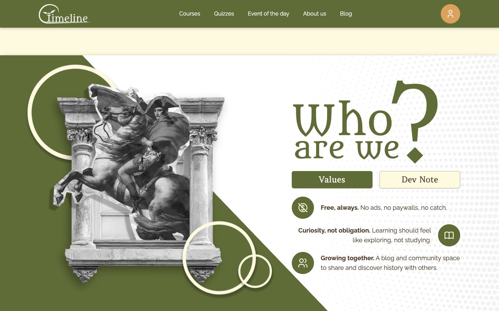

# Timeline

**A free website for learning history:** courses with lessons, quizzes, a blog, and a daily "on this day" event.

- **Live app:** https://timeline.appwrite.network/
- **Repository:** https://github.com/Mihaela1909/TimelineAppProject


---

## Contents

1. [Features](#features)
2. [Roles and permissions](#roles-and-permissions)
3. [Tech stack](#tech-stack)
4. [Running it locally](#running-it-locally)
5. [Appwrite setup](#appwrite-setup)
6. [Architecture](#architecture)
7. [Security model](#security-model)
8. [UX and accessibility](#ux-and-accessibility)
9. [Known limitations](#known-limitations)
10. [AI-assisted development](#ai-assisted-development)
11. [Screenshots](#screenshots)

---

## Features

**Public site (anyone)**
- **Courses:** search, filter by category, sort, paginate. Each course has an overview page and lessons with rich-text content and images.
- **Quizzes:** one per course, with multiple-choice questions, instant feedback and a results screen.
- **Blog:** articles with categories, read time, sharing, and a "Browse more" carousel.
- **Event of the Day:** a historical event for any date (Wikipedia "On this day" API), with prev/next day, a date picker and a random date. The date lives in the URL, so it can be shared.
- An animated home page with popular courses, a quiz teaser, the event of the day, an "About us" section and a blog preview.

**Logged-in users**
- Course progress: mark lessons complete or undo, plus "In Progress" / "Completed" badges and a "Continue · Lesson N" button.
- Quiz attempts are saved, and quizzes show Passed / Failed / Not attempted.
- Save blog posts to read later.
- Profile page with stats (enrolled, completed, quizzes taken, average score), course progress, quiz history, saved posts, and settings (name, email, password).
- Profile picture and header photo. **Every upload or removal is reviewed by an admin** before it goes live.

**Admin panel (`/admin`, staff only)**
- Dashboard with counts and recent activity.
- Create, edit, publish and delete **courses, lessons, quizzes, quiz questions** (drag or arrow keys to reorder) and **blog posts**, with image uploads.
- *Admin only:* manage users (change role, deactivate or reactivate), approve or reject profile photos, and a statistics page (course engagement, quiz performance, community breakdown).

---

## Roles and permissions

| | Guest | User | Editor | Admin |
|---|:-:|:-:|:-:|:-:|
| Browse courses, lessons, quizzes, blog, Event of the Day | ✅ | ✅ | ✅ | ✅ |
| Take quizzes | ✅ (not saved) | ✅ | ✅ | ✅ |
| Save progress, attempts and posts; profile page | → login | ✅ | ✅ | ✅ |
| Upload or remove profile photos (needs approval) | — | ✅ | ✅ | ✅ |
| Admin panel: courses, lessons, quizzes, blog | — | — | ✅ | ✅ |
| Users, roles, statistics, image approvals | — | — | — | ✅ |

The router hides pages a role can't use, but **the real enforcement is in Appwrite's permissions** (see [Security model](#security-model)).

---

## Tech stack

| | |
|---|---|
| Front end | **Vue 3** (Composition API, `<script setup>`), **Vue Router 4**, **Vite** |
| Styling | **Tailwind CSS 3**, with a brand palette defined once as CSS variables in `src/style.css` |
| Backend | **Appwrite Cloud**: Auth (email + password), TablesDB, Storage |
| Hosting | **Appwrite Sites** |
| Rich text | TipTap (admin lesson and blog editor) |
| External API | Wikipedia REST API ("On this day"), no key needed |

No backend code, no state library (shared state uses module-level composables), and no UI, icon or chart libraries. Icons are inline SVG (`AppIcon.vue`), and charts are plain HTML and Tailwind.

---

## Running it locally

Requirements: Node 20.19+ (Vite 8) and an Appwrite project set up as described below.

```bash
git clone https://github.com/Mihaela1909/TimelineAppProject.git
cd TimelineAppProject
npm install
cp .env.example .env      # then fill in your Appwrite IDs
npm run dev               # http://localhost:5173
```

| Script | |
|---|---|
| `npm run dev` | dev server |
| `npm run build` | generates `public/sitemap.xml` from published content, then builds into `dist/` |
| `npm run preview` | serve the production build |

**Deploying to Appwrite Sites:** connect the GitHub repo, use build command `npm run build` and output directory `dist`, add the same `VITE_…` environment variables in the Site's settings, and set the **fallback file to `index.html`**, so deep links like `/courses/123` work on refresh. Vite bakes the variables in at build time, so redeploy after changing them.

---

## Appwrite setup

### Auth labels
Staff accounts need an Appwrite **user label** (Auth → user → Labels), because labels are what table permissions check:
- `admin`: full access
- `editor`: content only

Their `profiles.role` should match (`admin` / `editor`); the app uses it to show the right pages.

### Tables

All rows reference each other by ID (e.g. `lessons.courseId`). "Row Security ON" means each row carries its own permissions, set by the app when it creates the row.

| Table | Main columns | Row Security | Table-level permissions |
|---|---|---|---|
| `profiles` | `userId`, `name`, `email`, `role`, `active`, `avatarImageId`, `headerImageId` | ON | Create → Users · Read + Update → label `admin` |
| `profile_settings` | `userId`, `pendingAvatarImageId`, `pendingHeaderImageId` | ON | Create → Users · Read + Update → label `admin` |
| `courses` | `title`, `description`, `category`, `lessonCount`, `coverImageId`, `headerImageId`, `published` | — | Read → Any · Create / Update / Delete → labels `admin`, `editor` |
| `lessons` | `courseId`, `title`, `order`, `content`, `imageId`, `published` | — | Read → Any · Create / Update / Delete → `admin`, `editor` |
| `quizzes` | `courseId`, `title`, `passingScore`, `coverImageId`, `headerImageId`, `published` | — | Read → Any · Create / Update / Delete → `admin`, `editor` |
| `quiz_questions` | `quizId`, `questionText`, `options[]`, `correctOptionIndex`, `order` | — | Read → Any · Create / Update / Delete → `admin`, `editor` |
| `blog_posts` | `title`, `category`, `introduction`, `content`, `readTime`, `coverImageId`, `published` | — | Read → Any · Create / Update / Delete → `admin`, `editor` |
| `progress` | `userId`, `courseId`, `lessonId` | **ON** | Create → Users · Read → `admin` · Delete → `admin`, `editor` |
| `quiz_attempts` | `userId`, `quizId`, `score`, `totalQuestions` | **ON** | Create → Users · Read → `admin` · Delete → `admin`, `editor` |
| `saved_posts` | `userId`, `postId` | **ON** | Create → Users |

**Storage:** one `media` bucket with File Security **off**: Read → Any, Create → Users. Images are shown with `getFileView()`, because `getFilePreview()` needs a paid plan.

---

## Architecture

The full rules are in **[AGENTS.md](AGENTS.md)**: layers, SRP/SoC, the check-and-reset pattern, and Vue and design conventions. Project decisions and history are in **[CLAUDE.md](CLAUDE.md)**.

**Data flows one way: view → composable → service → Appwrite.**

```
src/
├── services/      Data access. One file per table (courseService.js …). Plain async functions, no Vue.
│                  appwrite.js is the ONLY file that creates the Appwrite client.
├── composables/   Application logic: state (ref), loading/error, combining services, validation.
├── views/         One component per route (views/admin/ for the admin panel). Layout + wiring events.
├── components/    UI driven by props/emits: ui/ (reusable), layout/, and feature folders
│                  (home/, courses/, quizzes/, blog/, profile/, auth/, admin/).
├── layouts/       PublicLayout (header + footer) and AdminLayout (sidebar / mobile drawer).
├── router/        Routes (lazy-loaded) + the navigation guard.
├── constants/     Roles, category colours, shared values.
└── utils/         Small pure helpers (dates, text).
```

**Example: "Save post"**
1. `BlogPostDetailView` (button) calls
2. `useSavedPosts().toggle()`, which has a busy guard and updates the shared state, which calls
3. `savedPostService.savePost()`, which checks for a duplicate and then runs `createRow` with permissions for that user only.

**Patterns worth noting**
- **Check and reset:** every user action blocks double submits, validates and trims input, clears the previous error, always resets its busy flag in `finally`, returns `true` / `false`, and shows a toast.
- **Pure logic kept separate:** e.g. `buildStatistics()` takes plain data and returns the stats, with no loading or Vue involved.
- **Full reads page through results:** Appwrite returns only 25 rows by default, so every "get all" uses `listAllRows()` (cursor pagination).
- **Cascading deletes:** deleting a course removes its lessons, quizzes, questions, attempts and progress first, so a failure leaves the parent in place to retry.
- **Shared state without a store library:** `useAuth`, `useToast` and `useSavedPosts` keep module-level state shared across pages.

---

## Security model

**Hiding buttons and guarding routes is only UX.** The router guard (`meta.requiresAuth`, `meta.requiresRole`) sends guests to login and other roles to the 404 page. Every rule also exists as an **Appwrite permission**, so calling the API directly from the browser console is rejected with 401.

- **Content tables:** anyone can read; only the `admin` / `editor` labels can write.
- **`profiles` holds `role`:** users can read their own row but **not update it**, so nobody can make themselves admin. `createProfile` sets explicit permissions, because Appwrite's default would give the creator update rights.
- **Photo approval can't be skipped:** live photo IDs are in `profiles`, which users can't write. Users only write *pending* IDs in `profile_settings`, which is a separate table because Appwrite permissions apply to whole rows, not single columns.
- **Personal rows** (`progress`, `quiz_attempts`, `saved_posts`): Row Security is on, and each row grants Read (+ Delete) only to its owner. There is no Update, so users can't edit their own scores.
- **XSS:** Vue escapes all normal output. The only raw HTML (lesson and blog content) is passed through an allow-list sanitizer (`utils/sanitizeHtml.js`) before `v-html`, so `<script>`, event handlers and `javascript:` links are removed even if written straight to the database.
- **CSRF and brute force:** Appwrite only accepts requests from the registered web platforms (other origins get 403) and with the project header, and it rate-limits login attempts (429 after 10 tries).
- **No secrets in the repo:** `.env` is git-ignored. Its values are public IDs that end up in the browser bundle anyway. No Appwrite API key is used anywhere in the front end.

---

## UX and accessibility

- **Every data view has loading, empty and error states:** skeletons, a friendly empty message with a next step, and an error box with **Retry**.
- **Feedback for every action** through toasts; confirmation dialogs before destructive actions; buttons disabled while saving.
- **Validation:** required fields, minimum lengths, required images, friendly messages (never raw Appwrite errors).
- **Responsive** from 390px phones up; the admin sidebar becomes a slide-in drawer on phones.
- **Accessibility:**
  - "Skip to main content" link and semantic landmarks
  - labelled inputs and `aria-label` on icon buttons
  - `alt` on every image
  - toasts announced (`role="status"`) and errors as `role="alert"`
  - an accessible confirm dialog (focus moved in and trapped, Escape closes it)
  - visible focus rings and keyboard reordering of quiz questions
  - contrast rules for the palette
  - all animations off under `prefers-reduced-motion`

### SEO
- **Per-page metadata:** each page sets its own title and description, a canonical URL and link-preview tags (Open Graph, with a 1200×630 preview image). Course, lesson, quiz and blog pages use their real content.
- **Hidden from search:** login, register, profile, admin and 404 are marked `noindex`.
- **`robots.txt` and `sitemap.xml`:** the sitemap is generated at build time by `scripts/generate-sitemap.mjs`. It lists every published course, lesson, quiz and blog post, read from Appwrite's public API as a guest.

---

## Known limitations

These need server-side code (an Appwrite Function with an API key), which is out of scope for a front-end-only project:

- **Role vs. label:** changing a user's role in the app updates `profiles.role`, but the matching Appwrite label still has to be added in the console.
- **Deactivation** is enforced by the app (the user is signed out on the next page load). A hard block uses the console's "Block user".
- **Quiz grading happens in the browser,** so a determined user could submit a fake attempt through the API.
- **Deleting an account** only signs the user out; removing an Auth account needs the server SDK.
- **Rejected or replaced images stay in the bucket** (no cleanup yet).
- **Statistics are calculated in the browser** from full table reads. This is fine at this size; it would move to a Function for large data.
- "Most Popular Courses" shows the first published courses, because guests can't read progress, so there's no popularity data.

---

## AI-assisted development

<!-- To be completed: tools used, what for, and examples of reviewing / correcting AI suggestions. -->

AI (Claude Code) was used during development. Its work was guided and constrained by the project rules in [AGENTS.md](AGENTS.md), with decisions recorded in [CLAUDE.md](CLAUDE.md). All changes were reviewed, and security-relevant permissions were set and tested by hand in the Appwrite console.

---

## Screenshots

| | |
|---|---|
|  |  |
|  |  |
|  |  |


